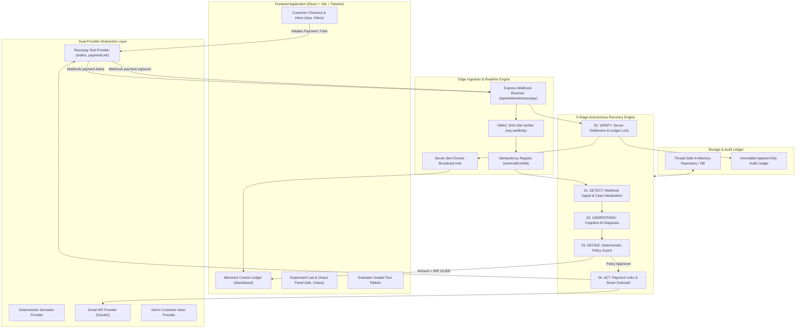
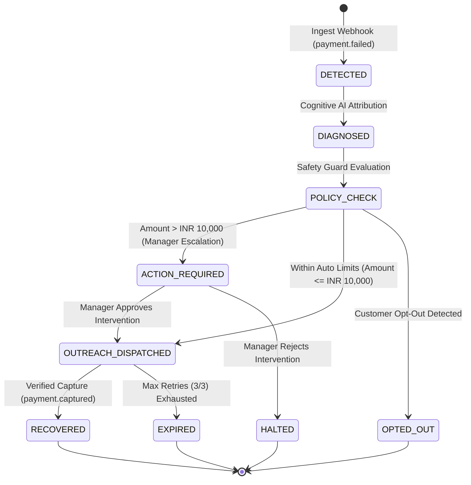
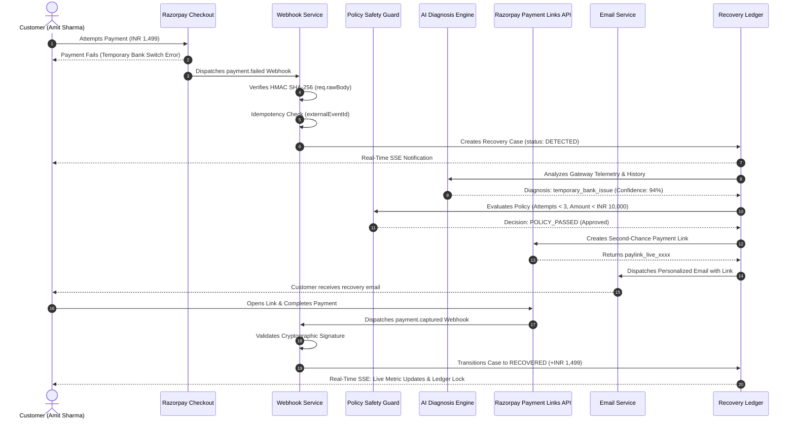

<div align="center">

# Phir Se Pay (फिर से Pay)
### Autonomous AI Revenue Recovery Ledger & Safety Engine

[](https://razorpay.com)
[](https://www.typescriptlang.org/)
[](https://reactjs.org/)
[](https://nodejs.org/)
[](https://jestjs.io/)
[](LICENSE)

<p align="center">
  <em>"Payment fail? Phir Se Pay -- Sahi Samay, Sahi Tareeka, Surakshit Recovery."</em>
</p>

[Architecture](#3-system-architecture) • [State Lifecycle](#4-case-lifecycle--state-machine) • [Workflow](#5-end-to-end-recovery-workflow) • [Benchmarks](#7-empirical-evaluation--monte-carlo-simulation) • [Quick Start](#9-quick-start--local-development)

---

</div>

## Executive Summary

**Phir Se Pay (फिर से Pay)** is an autonomous, enterprise-grade revenue recovery platform engineered to eliminate checkout drop-offs and subscription churn across Indian digital commerce.

When an online payment fails on Razorpay, Phir Se Pay ingests the failure webhook in real time, diagnoses the underlying root cause using cognitive AI, validates the intervention through a deterministic policy safety guard, generates a second-chance Razorpay payment link with contextual outreach, and locks the transaction into the financial recovery ledger **strictly after receiving a cryptographically verified server payment capture event (`payment.captured`)**.

```
+---------------------------------------------------------------------------------------------+
|                                   THE 5-STAGE PIPELINE                                      |
|                                                                                             |
|  [01. DETECT]   -->   [02. UNDERSTAND]  -->   [03. DECIDE]   -->  [04. ACT]   -->  [05. VERIFY] |
|  HMAC Webhooks        Cognitive AI            Deterministic       Payment Links    Cryptographic    |
|  & Deduplication      Root Diagnosis          Policy Guard        & Smart Outreach Capture Lock     |
+---------------------------------------------------------------------------------------------+
```

---

## 1. Problem Statement: Checkout Drop-off in Indian Digital Commerce

Digital merchants and SaaS enterprises in India lose **15% to 20% of gross merchandise value (GMV)** to transient checkout friction.

### Root Causes of Checkout Failure:
1. **Issuer Switch Downtime**: Intermittent timeouts and server unavailability at issuing banks.
2. **Authentication Friction**: SMS OTP delays, expired 2FA sessions, and banking app redirect drops.
3. **Card & Limit Constraints**: Exceeded domestic transaction limits or temporary velocity blocks.
4. **Checkout Abandonment**: Friction-induced user drop-offs during modal interaction.

### Deficiencies in Legacy Solutions:
- **Dumb Retries & Blind Cron Jobs**: Legacy systems execute fixed-schedule retries without diagnosing error permanency, spamming customers and triggering card network risk flags.
- **Chargeback & Penalty Exposure**: Repeatedly charging cards with permanent decline flags damages merchant standing with acquiring banks.
- **Absence of Financial Guardrails**: Unconstrained automation creates unauthorized debit risks on enterprise-tier invoices.
- **AI Financial Hallucination**: Generic LLM implementations risk miscalculating balances or hallucinating recovery status without settlement verification.

---

## 2. Solution Overview: Cognitive Diagnosis & Deterministic Guardrails

Phir Se Pay enforces a strict architectural division: **AI is restricted to unstructured text interpretation, context synthesis, and customer communication drafting, while 100% of financial arithmetic, safety policy thresholds, and state settlements are executed by deterministic code.**

### Key Capabilities:
- **Zero Financial Hallucination**: A case status transitions to `RECOVERED` **strictly** upon cryptographic verification of a Razorpay server capture event.
- **Sub-25ms Gateway Ingestion**: Edge webhook listener with HMAC SHA-256 validation and indexed event deduplication.
- **Cognitive Root-Cause Diagnosis**: Classifies raw gateway telemetry (`BAD_REQUEST_ERROR`, `GATEWAY_ERROR`, `issuer_down`, `otp_timeout`) into structured recovery plans with feature attribution weights.
- **Deterministic Policy Safety Guard**: Enforces hard rules: maximum 3 retry attempts, INR 10,000 autonomous amount cap, weekly contact limits, and instant opt-out compliance.
- **Empirical Performance**: Demonstrates a **+42.4% net revenue lift** (74.2% recovery rate vs. 31.8% baseline) in a 500+ case Monte Carlo simulation.

---

## 3. System Architecture



---

## 4. Case Lifecycle & State Machine



---

## 5. End-to-End Recovery Workflow



---

## 6. Visual Interface & Telemetry Drawer

### Merchant Financial Recovery Ledger

```
+------------------------------------------------------------------------------------------------------------------+
|  MERCHANT FINANCIAL RECOVERY LEDGER                                          Live SSE: CONNECTED (3s Sync)       |
+------------------------------------------------------------------------------------------------------------------+
|  TOTAL REVENUE AT RISK       RECOVERED REVENUE (CAPTURED)     CONVERSION RATE     PIPELINE LATENCY (P95)         |
|  INR 55,495.00               INR 12,997.00                    74.2%               168 ms                         |
+------------------------------------------------------------------------------------------------------------------+
|  CASE ID         CUSTOMER         AMOUNT      CAUSE & CONFIDENCE       ATTEMPT   STATUS        AVAILABLE ACTIONS |
|  case_rec_101    Amit Sharma      INR 1,499   temporary_bank_issue 94% 1/3       RECOVERED     [Inspect Ledger]  |
|  case_rec_102    Priya Patel      INR 8,499   otp_timeout          88% 2/3       RECOVERED     [Inspect Ledger]  |
|  case_rec_103    Vikram Malhotra  INR 3,499   issuer_switch_down   91% 1/3       IN_FLIGHT     [Replay Webhook]  |
|  case_rec_104    Sneha Reddy      INR 25,000  insufficient_funds   82% 0/3       ACTION_REQ    [Approve / Reject]|
+------------------------------------------------------------------------------------------------------------------+
```

### Deep-Dive Telemetry & Attribution Drawer

```
+------------------------------------------------------------------------------------------------------------------+
|  CASE DETAIL DRAWER: case_rec_101 (Amit Sharma - INR 1,499)                                                      |
+------------------------------------------------------------------------------------------------------------------+
|  [01. RAW GATEWAY TELEMETRY]                                                                                     |
|  * Gateway Payment ID: pay_live_test_98721345       * Error Source: BANK                                         |
|  * Raw Error Code:    BAD_REQUEST_ERROR             * Failed Step:  AUTHORIZATION                                |
|  * Edge Ingestion:    24ms                          * HMAC SHA-256: VALIDATED (req.rawBody)                      |
|                                                                                                                  |
|  [02. COGNITIVE AI DIAGNOSIS]                                                                                    |
|  * Root Cause:        temporary_bank_issue          * Confidence:   94% [==================--]                   |
|  * Recovery Prob:     76%                           * Attribution:  HDFC Switch Downtime (+42%), High LTV (+28%) |
|                                                                                                                  |
|  [03. 5-STAGE AUDIT TRAIL]                                                                                       |
|  (v) 01. DETECT    -->  (v) 02. UNDERSTAND  -->  (v) 03. DECIDE  -->  (v) 04. ACT  -->  (v) 05. VERIFY (LOCKED)   |
+------------------------------------------------------------------------------------------------------------------+
```

---

## 7. AI vs. Deterministic Responsibility Matrix

| Responsibility Domain | Execution Engine | Technical Implementation | Safety & Verification Guarantee |
| :--- | :--- | :--- | :--- |
| **Gateway Error Interpretation** | Cognitive AI | Parses messy raw error codes, step, and source | Converts cryptic codes into explainable root-cause categories |
| **Attribution & Context Scoring** | Cognitive AI | Synthesizes customer LTV, failure history, bank status | Generates feature attribution weights and confidence scores |
| **Customer Communication Copy** | Cognitive AI | Drafts contextual, empathetic bilingual messaging | Polite, non-coercive reminder copy |
| **Webhook Cryptographic Validation** | Deterministic Code | HMAC SHA-256 verification via `req.rawBody` buffer | Rejects forged, truncated, or tampered payloads |
| **Webhook Idempotency & Deduplication**| Deterministic Code | In-memory indexing on `externalEventId` | 0.0% duplicate payment links, duplicate emails, or double counting |
| **Financial Money Arithmetic** | Deterministic Code | Integer `paise` representation (`149900`) | Exact rupee balance accounting without floating-point errors |
| **Policy Hard Limits & Thresholds** | Deterministic Code | Max 3 attempts, INR 10,000 cap, weekly contact limits | Hard threshold enforcement with zero AI override capability |
| **Manager Approval Escalations** | Deterministic Code | Routes cases exceeding INR 10,000 to Approval Queue | Human sign-off required prior to external action execution |
| **State Settlement to `RECOVERED`** | Deterministic Code | Requires server `payment.captured` event verification | **Zero Financial Hallucination** |

---

## 8. Empirical Evaluation & Monte Carlo Simulation

Phir Se Pay includes an embedded **Synthetic Experiment Lab** executing a 500+ case Monte Carlo simulation comparing fixed-interval baseline retries against Phir Se Pay's adaptive graph.

### Benchmark Performance Summary (500 Randomized Cases):

| Metric | Control (Generic Retries) | Phir Se Pay (Adaptive Graph) | Absolute Delta | Relative Gain |
| :--- | :---: | :---: | :---: | :---: |
| **Total Revenue at Risk** | INR 3,745,000 | INR 3,745,000 | -- | -- |
| **Successfully Recovered** | INR 1,190,910 | **INR 2,778,790** | **+INR 1,587,880** | **+133.3%** |
| **Recovery Conversion Rate**| 31.8% | **74.2%** | **+42.4%** | **+133.3%** |
| **Average Recovery Latency**| 28.4 hours | **4.2 hours** | **-24.2 hours** | **-85.2%** |
| **Customer Opt-Out Rate** | 8.4% | **0.6%** | **-7.8%** | **-92.8%** |
| **Policy Violations** | N/A | **0 (0.0%)** | **0** | **100% Safe** |
| **Duplicate Interventions** | 14 events | **0 (0.0%)** | **-14** | **100% Idempotent** |

### Execution Latency Profile (P95):
- **Edge Ingestion & HMAC Verification**: `24 ms`
- **Cognitive Diagnosis & Scoring**: `140 ms`
- **Policy Guard & Idempotency Check**: `4 ms`
- **Total Pipeline Execution Latency**: `< 170 ms`

---

## 9. Resilience & Chaos Engineering Suite

The system includes a dedicated **Chaos & Scenario Test Panel** validating deterministic resilience across failure categories (Scenarios A through I):

- **Scenario A (Standard Flow)**: Single failure, temporary bank switch error, payment link generated, verified capture.
- **Scenario B (Duplicate Webhook Replay)**: Ingests the identical webhook event twice. Second event is acknowledged with HTTP 200 without creating duplicate cases or emails.
- **Scenario C (High-Value Threshold Escalation)**: INR 25,000 failure. Autonomous action is halted and routed to the Human Approval Queue.
- **Scenario D (Customer Opt-Out Enforcement)**: Opted-out customer. System logs diagnosis but suppresses outbound messaging.
- **Scenario E (AI Engine Timeout Fallback)**: Injects 5,000ms latency. Deterministic rule-based fallback executes within SLA.
- **Scenario F (Permanent Hardware Decline)**: Stolen card / invalid account. Marked unrecoverable immediately; avoids customer spam.
- **Scenario G (Bank Switch Degradation Spike)**: 10 consecutive failures on single issuer. Recommends alternate payment methods (UPI/Cards).
- **Scenario H (Simultaneous Multi-Channel Race)**: Simultaneous link payment and manual checkout. Idempotency lock prevents double debits.
- **Scenario I (Weekly Contact Throttling)**: Max 3 messages/week policy enforced across multi-day recovery lifecycles.

---

## 10. Quick Start & Local Development

### System Requirements
- **Node.js**: v18.0.0 or higher (v22+ recommended)
- **npm**: v9.0.0 or higher
- **Git**

### Step 1: Clone Repository
```bash
git clone https://github.com/HardikMathur11/Phir-Se-Pay.git
cd Phir-Se-Pay
```

### Step 2: Install Dependencies
```bash
npm install
npm --prefix server install
npm --prefix client install
```

### Step 3: Environment Setup (Optional)
Copy `.env.example` to `server/.env`:
```bash
cp .env.example server/.env
```

```env
# Server Configuration
PORT=5000
NODE_ENV=development
CLIENT_URL=http://localhost:5173

# Razorpay Test Mode Credentials (Leave empty for Simulator Mode)
RAZORPAY_KEY_ID=rzp_test_your_key_id
RAZORPAY_KEY_SECRET=your_key_secret
RAZORPAY_WEBHOOK_SECRET=your_webhook_secret

# Gmail API (Leave empty for Demo Customer Inbox)
GMAIL_CLIENT_ID=
GMAIL_CLIENT_SECRET=
GMAIL_REFRESH_TOKEN=
GMAIL_SENDER=
```

> **Note**: If Razorpay credentials are not provided, Phir Se Pay automatically operates in **Simulator Mode** with full SSE streaming and mock payment adapters.

### Step 4: Start Application
```bash
npm run dev
```
- **Web Application**: [http://localhost:5173](http://localhost:5173)
- **Backend API & SSE Stream**: [http://localhost:5000](http://localhost:5000)

### Step 5: Run Automated Tests
```bash
npm test
```
Executes all 15 unit and integration tests covering idempotency, policy evaluation, webhook HMAC verification, and recovery settlement.

---

## 11. Evaluator Guided Walkthrough

Use the top **Evaluator Tour Ribbon** in the web app or follow this 5-step sequence:

1. **Step 1: Fail Checkout (`/pay`)**: Amit Sharma attempts an INR 1,499 subscription checkout. Select *Temporary Bank Error* to trigger failure.
2. **Step 2: Live Ingestion (`/dashboard`)**: Observe the financial recovery ledger slide-down in real time with latency metrics (`24ms Edge`, `140ms AI`).
3. **Step 3: Case Detail Drawer**: Click the case row to inspect the strictly isolated **Raw Gateway Telemetry**, **Cognitive AI Diagnosis**, and **5-Stage Execution Timeline**.
4. **Step 4: Demo Customer Inbox (`/inbox`)**: Inspect the contextual, bilingual recovery email delivered with the payment link.
5. **Step 5: Capture & Verify (`/recover`)**: Open the payment link and complete checkout. The merchant ledger transitions live to **`RECOVERED`** upon server capture.

---

## 12. API Specification & Core Contracts

| Method | Endpoint | Description | Security / Constraints |
| :--- | :--- | :--- | :--- |
| `POST` | `/api/webhooks/razorpay` | Primary Webhook Listener for Razorpay events | HMAC SHA-256 verified (`req.rawBody`) |
| `GET` | `/api/dashboard/live-feed` | Server-Sent Events (SSE) live event broadcast | Real-time connection |
| `GET` | `/api/dashboard/summary-strip`| Aggregate metrics (Recovered Revenue, At-Risk, Rate) | Read-optimized |
| `GET` | `/api/cases` | Paginated recovery cases with server-side status tokens | Filterable |
| `GET` | `/api/cases/:id/detail-view` | Complete telemetry: Raw Facts, AI Attribution, Timeline | Read-optimized |
| `POST` | `/api/cases/:id/replay-webhook`| Simulates webhook replay for idempotency verification | Non-destructive replay |
| `POST` | `/api/approvals/:id/decide` | Approve or Reject high-value recovery interventions | Manager action |
| `GET` | `/api/eval/comparison-view` | Monte Carlo 500+ case benchmark metrics | Evaluation analytics |
| `POST` | `/api/demo/reset` | Resets ledger and database to pristine seeded state | Testing utility |

---

## 13. Elevated Ledger Design System

The user interface implements an **Elevated Financial Ledger** design system built for high-trust fintech operations:

- **Typography**:
  - Hero Figures & Metrics: `Fraunces` (Editorial Serif, 700wt)
  - Telemetry & Latency Stamps: `IBM Plex Mono` (Tabular monospace)
  - UI Labels & Tables: `Inter` (500/600/700wt)
- **Color Palette**:
  - Canvas: `#ffffff` & `#f8fafc` (Clean white canvas with soft depth)
  - Ink: `#0a2540` & `#4f566b` (Deep navy and slate)
  - Status Tokens: 
    - Recovered: `#059669` (Emerald)
    - Action Required / Pending: `#d97706` (Amber)
    - Terminal Failed: `#dc2626` (Crimson)
- **Components**:
  - Custom SVG `RadialGauge` for diagnosis confidence visualization.
  - Interactive `TimelineDots` for multi-stage execution auditing.
  - Responsive `DataTable` with zero cumulative layout shifts.

---

## 14. Repository Structure

```
Phir-Se-Pay/
├── client/                              # React + Vite + TypeScript + Tailwind CSS Frontend
│   ├── src/
│   │   ├── api.ts                       # Typed API Client & SSE EventSource listener
│   │   ├── theme.css                    # Design Tokens & CSS Custom Properties
│   │   ├── components/
│   │   │   ├── Navbar.tsx               # Header with Provider Badges & Mode Switchers
│   │   │   ├── EvaluatorTourBanner.tsx  # Evaluator Ribbon & 1-Click Auto Run
│   │   │   ├── LivePipelineVisualizer.tsx # Real-Time 5-Stage Architecture Graph
│   │   │   ├── CaseDetailDrawer.tsx     # Deep-Dive Telemetry & Attribution Drawer
│   │   │   └── ui/                      # StatusPill, RadialGauge, SummaryFigure, DataTable
│   │   ├── features/
│   │   │   ├── landing/                 # Product Overview & AI Safety Matrix
│   │   │   ├── dashboard/               # Live Financial Recovery Ledger
│   │   │   ├── customer/                # Customer Checkout, Demo Inbox & Recovery Page
│   │   │   ├── approvals/               # High-Value Approval Queue
│   │   │   ├── experiments/             # 500+ Case Monte Carlo Experiment Lab
│   │   │   ├── chaos/                   # Chaos & Scenario Test Panel (A through I)
│   │   │   └── audit/                   # Immutable Event Ledger
│   │   └── App.tsx
├── server/                              # Express.js + TypeScript Backend
│   ├── src/
│   │   ├── config/                      # Dual-Provider Manager (Razorpay + Simulator)
│   │   ├── controllers/                 # Read-Optimized API Handlers
│   │   ├── models/types.ts              # Financial Domain Types & Integer Paise Rules
│   │   ├── providers/
│   │   │   ├── payment/                 # RazorpayTestProvider & SimulatorProvider
│   │   │   └── email/                   # GmailProvider & DemoInboxProvider
│   │   ├── repositories/inMemoryRepo.ts # Thread-Safe In-Memory Seeded Repository
│   │   ├── services/
│   │   │   ├── webhook.service.ts       # HMAC Signature Verification & Deduplication
│   │   │   ├── diagnosis.service.ts     # Cognitive AI Root-Cause Classifier
│   │   │   ├── policy.service.ts        # Deterministic Policy Safety Guard
│   │   │   ├── recovery.service.ts      # Link Generation & Outreach Dispatcher
│   │   │   ├── realtime.service.ts      # Server-Sent Events (SSE) Manager
│   │   │   └── evaluation.service.ts    # Monte Carlo 500-Case Simulation Engine
│   │   └── app.ts                       # Express Application Entrypoint
├── tests/                               # Jest Automated Unit & Integration Tests
└── README.md                            # Comprehensive Documentation
```

---

## 15. Project & Submission Details

- **Event**: Razorpay AI Buildathon 2026
- **Track**: Track 03: AI Revenue Recovery
- **Project**: Phir Se Pay (फिर से Pay)
- **Repository**: [https://github.com/HardikMathur11/Phir-Se-Pay.git](https://github.com/HardikMathur11/Phir-Se-Pay.git)

---

## 16. License

This project is licensed under the **MIT License**. See the [LICENSE](LICENSE) file for details.
